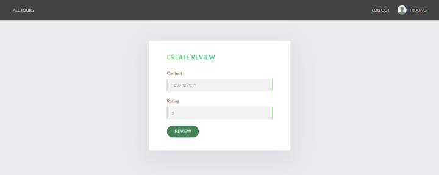
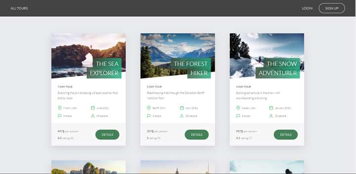
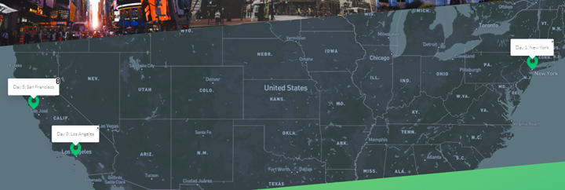
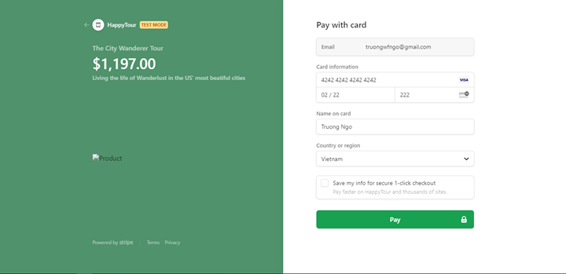
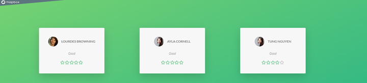

# 


# Welcome to **Happy Tour**
  
Khi làn sóng đại dịch COVID-19 kết thúc, nhu cầu du lịch sẽ bùng nổ trên toàn thế
giới trong đó có Việt Nam. Để đón đầu nhu cầu du lịch ngày càng cao và đảm bảo
chất lượng dịch vụ, quản lý hiệu quả và tiếp cận khách hàng dễ dàng hơn, chúng
tôi đã triển khai hệ thống quản lý và đặt tour du lịch - Happy Tour . Giúp
khách hàng dễ dàng đặt vé trực tuyến và giúp chủ doanh nghiệp dễ dàng quản lý
đội ngũ nhân viên và các tour du lịch. Từng bước tin học hóa mọi thông tin dữ liệu
và quản lý và thay thế dần các công tác quản lý thủ công của cửa hàng sang trực
tuyến. Qua đó đem lại nguồn doanh thu lớn hơn cho doanh nghiệp

# 📝 Function

### Đăng nhập
* [x] Login
* [x] Logout
* [x] Create account
* [x] Reset
* [x] Fogot
* [x] Verify email

### Khách Hàng
* [x] Booking
* [x] Cancel
* [x] Xem danh sách tour
* [x] Thanh toán
* [ ] Hoàn trả tiền
* [x] Review
* [x] Xem danh sách tour đã đặt
* [ ] Gửi tin nhăn cho nhân viên
* [x] Theo dõi lịch trình di chuyển
* [ ] Nhận email thông báo: tình trạng tour, khuyến mãi,...

### Nhân viên phụ trách thông tin tour nội địa

* [x] Thêm tour
* [x] Xóa tour
* [x] Sửa tour
* [ ] Chat với khách hàng

### Nhân viên phụ trách thông tin tour quốc tế

* [x] Thêm tour
* [x] Xóa tour
* [x] Sửa tour
* [ ] Tình trạng Visa
* [ ] Tình trạng tiêm chủng
* [ ] Chat với khách hàng

### Hướng dẫn viên du lịch

* [x] Xem tour mình hướng dẫn
* [x] Lấy danh sách Khách hàng tham gia tour
* [ ] Chat với Khách hàng
* [ ] Báo cáo tình trạng tour

### Nhân viên chăm sóc khách hàng

* [x] Booking
* [x] Cancel
* [x] Xem danh sách tour
* [ ] Chat với khách hàng

### Kế toán


* [ ] Thống kê dữ liệu về tour và khách hàng và tài chính theo tuần, tháng, năm
* [ ] Xuất báo cáo theo tuần, tháng, năm
* [ ] Tính lương dựa theo số liệu điểm danh của phần mềm thứ 3 tích hợp dữ liệu sẳn vào hệ thống

### Cửa hàng trưởng - Admin

* [x] Tất cả các quyền của nhân viên khác
* [x] Phân bổ quyền hạn nhân viên


# 🚦 How to install

1. Cài đặt NodeJS

  [Install NodeJS](https://nodejs.org/en/download/)
  
2. Cài đặt MongoDB

Ở file config.env thay đổi thông tin database
[document](https://docs.mongodb.com/)

```
DATABASE=mongodb+srv://truongwfngo:<PASSWORD>@cluster0.lym5b.mongodb.net/HappyTour?
JWT_SECRET=Ub3nappGV08yCdGVcB/Zrb8eTZUNBRyzYPWUvkprvbg
```

Ở file config.env thay đổi thông tin email

```
EMAIL_USERNAME=domain@gmail.com
EMAIL_PASSWORD=<password>
```

3. Cài đặt các gói npm hỗ trợ trong file package.json (dependencies)

```
npm install
```

4. Chạy project ở môi trường dev: 

```
npm start
```

5. Chạy project ở môi trường product: 

```
npm run start:prod
```
# 📈 Demo! 








[Demo](https://khangnt-1.herokuapp.com/)

# 💬 We're here to help!

[Thành Khang](nthanhkhang@outlook.com)

[Quang Trường](truongwfngo@gmail.com)

